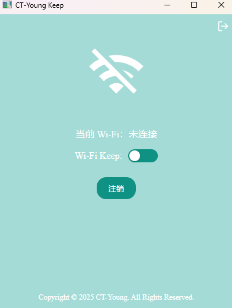
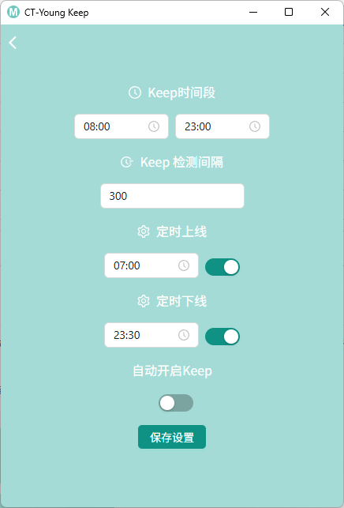

# CT-Young Keep 🚀

本程序是用于南昌工程学院校园网登录，主要解决南昌工程学院校园网不能在开启 VPN 的情况下进行认证（默认走系统代理），支持定时上下线。

支持主动保持连接，每隔一段时间检测并自动认证。

支持一键上下线，为其他设备腾出空间。

## 功能特性 ✨

- **VPN 兼容性 🌐:** 解决南昌工程学院校园网在开启 VPN 时无法认证的问题。
- **定时上下线 ⏰:** 支持设置定时自动登录和注销校园网。
- **主动保持连接 📡:** 定期检测网络连接状态，自动重新认证，防止掉线。
- **一键上下线 🖱️:** 方便快捷地登录和注销校园网，为其他设备释放连接。

## 使用方法 🛠️

略

## 注意事项 ⚠️

- 请确保你的网络环境稳定。
- 请妥善保管你的校园网账号和密码。
- 本程序仅用于方便校园网登录，请勿用于非法用途。
- 如果遇到问题，请查看日志文件或联系开发者。
- 软件处于开发和功能验证阶段，还未发布正式版，推荐作者脚本[南昌工程学院校园网自动登录脚本/CT-Young/CMCC-5G/NIT-WIFI](https://greasyfork.org/zh-CN/scripts/499597-%E5%8D%97%E6%98%8C%E5%B7%A5%E7%A8%8B%E5%AD%A6%E9%99%A2%E6%A0%A1%E5%9B%AD%E7%BD%91%E8%87%AA%E5%8A%A8%E7%99%BB%E5%BD%95)

## 贡献 🙌

欢迎提交 issue 和 pull request，共同完善本项目。

1.  Fork 本仓库
2.  创建你的特性分支 (`git checkout -b feature/your-feature`)
3.  提交你的修改 (`git commit -am 'Add some feature'`)
4.  推送你的分支 (`git push origin feature/your-feature`)
5.  创建新的 Pull Request

## 许可证 📄

MIT License

Copyright (c) 2025 Yowaimono

特此授权任何获得本软件副本及相关文档文件（“软件”）的人，免费地处理本软件，包括但不限于使用、复制、修改、合并、发布、分发、再许可和/或销售本软件副本的权利，并允许向其提供本软件的人员这样做，但须符合以下条件：

上述版权声明和本许可声明应包含在本软件的所有副本或重要部分中。

本软件按“原样”提供，不作任何形式的明示或暗示的保证，包括但不限于对适销性、适用于特定用途和不侵权的保证。在任何情况下，作者或版权持有人均不对任何索赔、损害或其他责任负责，无论是在合同、侵权或其他方面，因本软件或本软件的使用或其他交易而产生、产生或与之相关的。
